<p align="right"><b>English</b> · <a href="README.ko.md">한국어</a></p>

# Yuhan University LMS (e-Class) on Naver Cloud Platform

> An internship project that takes a real public-procurement notice from **KONEPS** (Korea ON-line E-Procurement System) —
> *"Yuhan University Learning Management System (e-Class) Maintenance"* — and re-designs and rebuilds its
> requirements from scratch on **Naver Cloud Platform (NCP)**.

<p>
  
  
  
  
  
</p>

| | |
| --- | --- |
| Period | 2025.07.29 (proposal) – 2025.08.21 (final presentation) |
| Format | Individual internship project at Cloud Square Inc. |
| Author | Minsoo Kang (Dept. of Artificial Intelligence, Konyang University) |
| Source notice | Yuhan University e-Class maintenance — Mar 2025 – Feb 2026, open competitive bidding (lump sum) |
| Cloud | Naver Cloud Platform (VPC environment) |
| Service endpoints | `101.79.10.254` (web public IP) / `lms-lb-107699287-8e09815088dd.kr.lb.naverncp.com` (Load Balancer) |

---

## Table of Contents

1. [Background](#1-background)
2. [Demo videos](#2-demo-videos)
3. [Final architecture](#3-final-architecture)
4. [How the architecture evolved](#4-how-the-architecture-evolved)
5. [Features](#5-features)
6. [Repository layout](#6-repository-layout)
7. [Infrastructure details](#7-infrastructure-details)
8. [Learning-progress design](#8-learning-progress-design)
9. [Work log](#9-work-log)
10. [Scope, limits and takeaways](#10-scope-limits-and-takeaways)
11. [Documents](#11-documents)

---

## 1. Background

Among the notices published on **KONEPS**, the national e-procurement system operated by the
Public Procurement Service of Korea, one project was selected against four criteria:

1. Fit with the project's purpose and direction
2. Technical and administrative feasibility
3. Reasonableness of the budget
4. Clarity and completeness of the published requirements

The result was the **Yuhan University Learning Management System (e-Class) maintenance** contract.

LMS platforms were adopted wholesale during COVID-19, and they remain central to university
operations even after the pandemic because they make **personalised, self-paced learning environments**
practical at scale. Being a daily LMS user myself was the other reason for picking this notice.

**Why the contract exists (from the RFP)**

- Sustain teaching quality and operational flexibility as online education grows in importance
- Provide an environment for analysing and monitoring learning outcomes, evaluation, feedback loops and education-policy research
- Build a system that supports systematic educational innovation and learner analytics
- Raise user satisfaction through stable, professionally managed LMS operations

---

## 2. Demo videos

Recordings of the running service. The original mp4 files are published as **Release assets**.

| Date | Content | Link |
| --- | --- | --- |
| 2025-08-04 | Web server provisioning and first screens | [▶ Watch](https://github.com/neodle/NCP-Yuhan-univ.LMS-Project/releases/download/v1.0-demo/20250804.mp4) |
| 2025-08-05 | Login · classroom · study page navigation | [▶ Watch](https://github.com/neodle/NCP-Yuhan-univ.LMS-Project/releases/download/v1.0-demo/20250805.mp4) |
| 2025-08-06 | Video lecture playback and progress | [▶ Watch](https://github.com/neodle/NCP-Yuhan-univ.LMS-Project/releases/download/v1.0-demo/20250806.mp4) |
| 2025-08-07 | Live lecture broadcasting demo | [▶ Watch](https://github.com/neodle/NCP-Yuhan-univ.LMS-Project/releases/download/v1.0-demo/20250807.mp4) |

> The full list is on the [Releases](https://github.com/neodle/NCP-Yuhan-univ.LMS-Project/releases) tab.

---

## 3. Final architecture

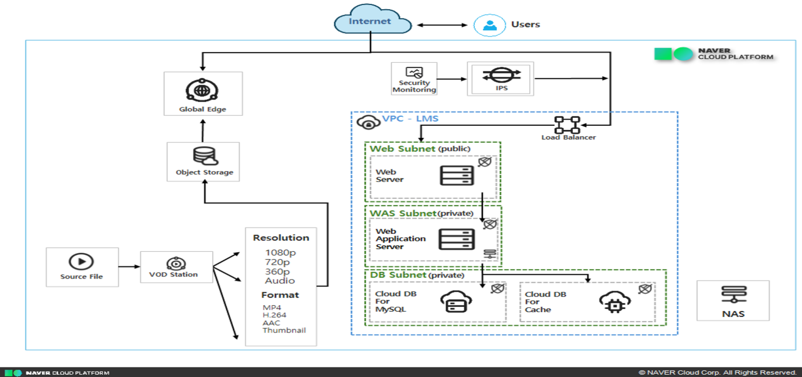

**At a glance**

- The **VPC - LMS** is split into three subnet tiers
  - `Web Subnet (public)` — web server
  - `WAS Subnet (private)` — web application server
  - `DB Subnet (private)` — Cloud DB for MySQL, Cloud DB for Cache
- Inbound traffic reaches the service only through **Security Monitoring → IPS → Load Balancer**
- Lecture video travels a separate path: **Source File → VOD Station (1080p/720p/360p/Audio, MP4 · H.264 · AAC · Thumbnail) → Object Storage → Global Edge (CDN)**
- **NAS** holds course materials and attachments

Splitting the traffic into two paths is the core idea. Web and API requests are served by the
Web · WAS · DB tiers inside the VPC, while **video streaming is handled outside the VPC by
Object Storage + Global Edge**, so the web servers never compete with video traffic for bandwidth.

---

## 4. How the architecture evolved

The design went through five revisions.

<details>
<summary><b>v1 — First draft, mapped straight from the RFP (2025.07.29)</b></summary>

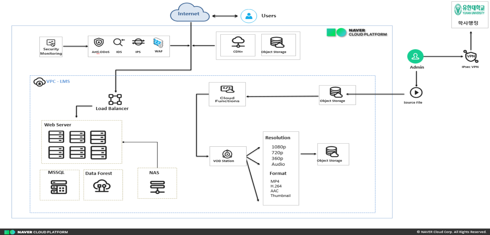

Every requirement in the RFP (CDN+, Object Storage, Anti-DDoS/IDS/IPS/WAF, MSSQL, Data Forest, NAS, IPsec VPN)
mapped 1:1 onto an NCP service. Complete on paper, but far too expensive and too large to build and verify.

</details>

<details>
<summary><b>v2 — Explicit upload path</b></summary>

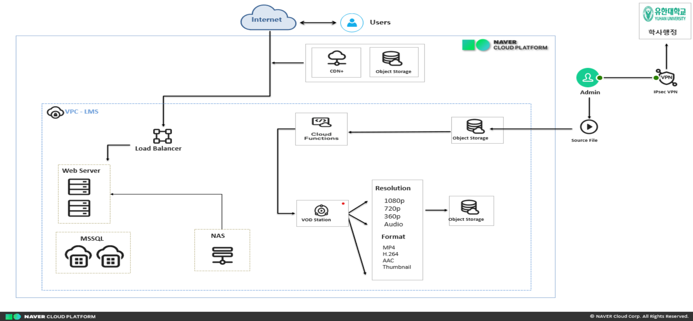

The administrator upload path (Source File → Object Storage → Cloud Functions → VOD Station) was made
explicit, and the web server was duplicated to remove a single point of failure.

</details>

<details>
<summary><b>v3 — Dedicated upload servers, MySQL instead of MSSQL</b></summary>

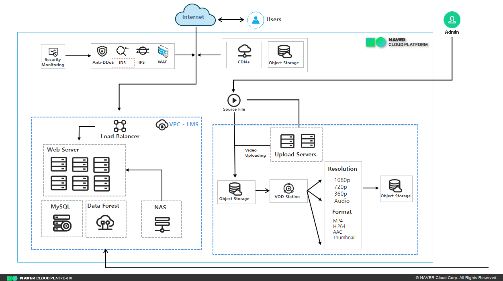

Video uploads were moved onto a dedicated server group, and the DBMS was switched from MSSQL to **MySQL**.
The RFP's own inventory lists MySQL, and it lowered the build cost as well.

</details>

<details>
<summary><b>v4 — Three-tier subnets and Auto Scaling</b></summary>

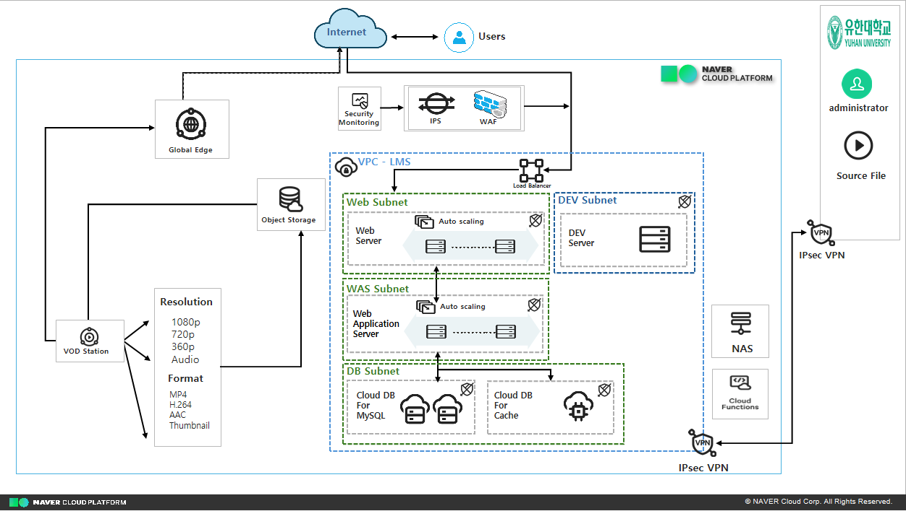

Web / WAS / DB were separated into their own subnets with Auto Scaling on the Web and WAS tiers.
A DEV subnet and an IPsec VPN link to the university's academic-affairs system were added here.

</details>

<details open>
<summary><b>v5 — Final: the version actually built</b></summary>


Scaled down to a **minimum viable prototype** that could genuinely be built inside a three-week internship.
Auto Scaling, WAF, the DEV subnet and the VPN — all slow to verify — were dropped, leaving the load-bearing
axis: **three-tier VPC + Load Balancer + highly available Cloud DB + the VOD/CDN pipeline**.

</details>

---

## 5. Features

| Screen | File | Notes |
| --- | --- | --- |
| Login | [`index.html`](index.html) | Calls `/api/login` and `/api/me`, redirects once the session is valid |
| Sign-up / password recovery | [`signup.html`](signup.html), [`findpw.html`](findpw.html) | Posts registration data to `/api/signup` |
| Main · classroom | [`main.html`](main.html), [`Pages/LS.html`](Pages/LS.html) | Enrolled-course list and classroom entry |
| Calendar | [`Pages/calendar.html`](Pages/calendar.html) | Academic schedule |
| Learning portfolio | [`Pages/portfolio.html`](Pages/portfolio.html) | Profile, self-introduction, activities, learning goals |
| Basic learning competency | [`Pages/basiclearn.html`](Pages/basiclearn.html) | Competency diagnostics area |
| Courses and lectures | [`Pages/curriculum.html`](Pages/curriculum.html), [`Pages/DeepCV.html`](Pages/DeepCV.html), [`Pages/FSlecture.html`](Pages/FSlecture.html) | Course and lecture management |
| Video study | [`Pages/studyFS.html`](Pages/studyFS.html), [`Pages/studyDeepCV.html`](Pages/studyDeepCV.html) | HLS playback, watch-time tracking, progress persistence |
| Certificate | [`Pages/certificate.html`](Pages/certificate.html) | Issues completion certificates for mandatory training |
| Grades | [`Pages/Gradeinquiry.html`](Pages/Gradeinquiry.html) | Grade lookup |

<table>
  <tr>
    <td width="50%">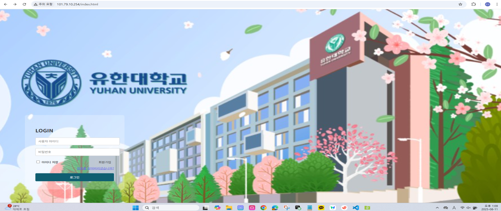<br><sub><b>Login</b> — entry screen styled after Yuhan University e-Class</sub></td>
    <td width="50%">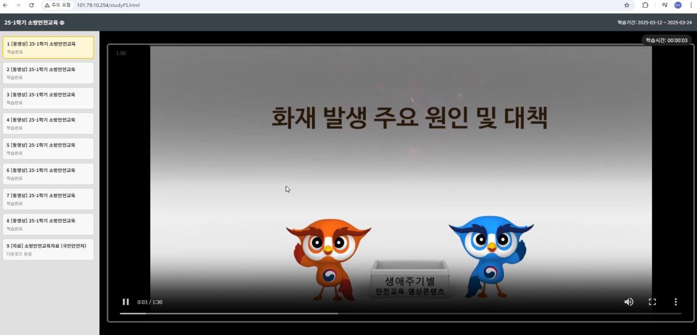<br><sub><b>Video study</b> — chapter list, completion state, live watch-time counter</sub></td>
  </tr>
  <tr>
    <td>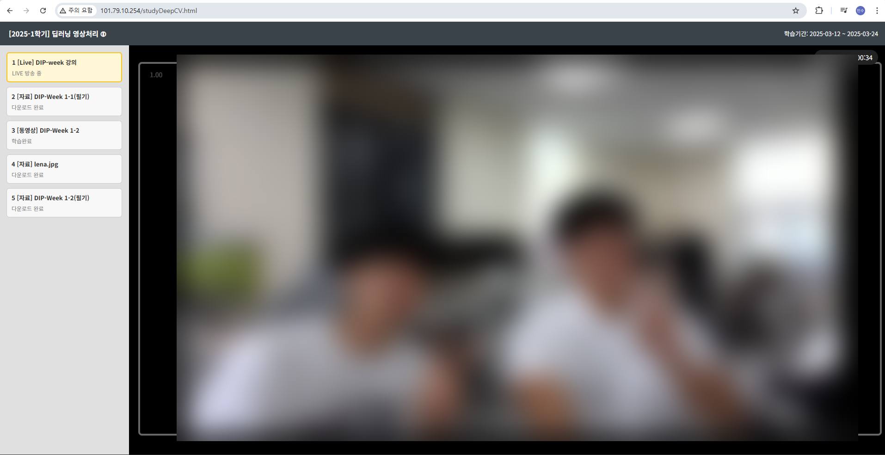<br><sub><b>Live lecture</b> — receiving an OBS broadcast (faces blurred)</sub></td>
    <td>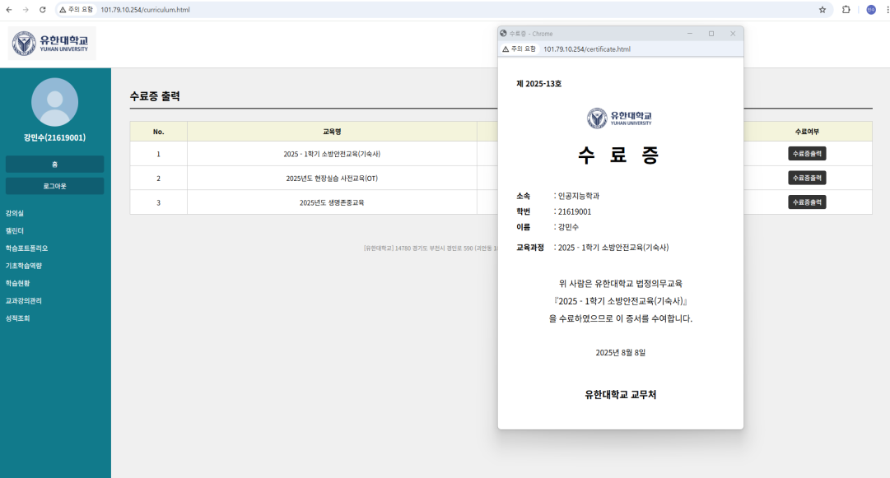<br><sub><b>Certificate</b> — issued once completion criteria are met</sub></td>
  </tr>
  <tr>
    <td>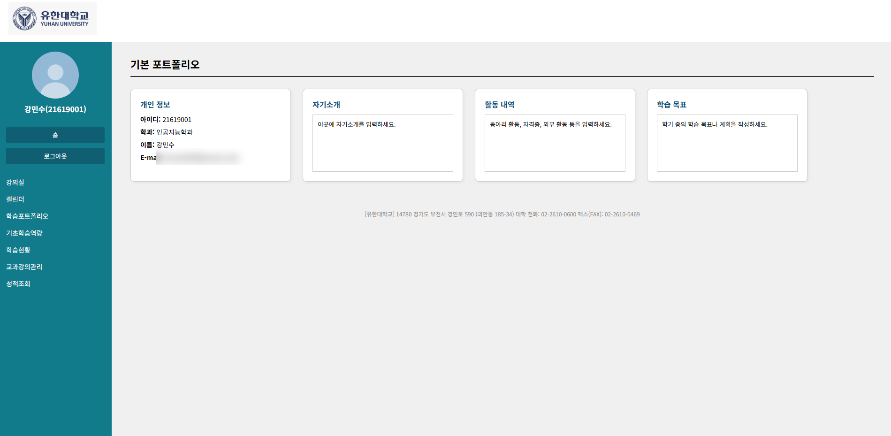<br><sub><b>Learning portfolio</b> — profile and learning goals</sub></td>
    <td>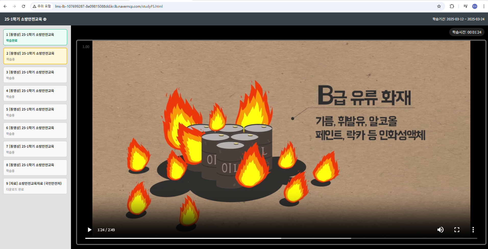<br><sub><b>Load Balancer</b> — the same service served through the LB domain</sub></td>
  </tr>
</table>

---

## 6. Repository layout

```
.
├── index.html            # Login (entry point)
├── signup.html           # Sign-up
├── findpw.html           # Password recovery
├── main.html             # Main · enrolled courses
├── Pages/                # Screens behind the login
│   ├── LS.html               # Classroom
│   ├── calendar.html         # Calendar
│   ├── curriculum.html       # Courses
│   ├── certificate.html      # Certificate printing
│   ├── portfolio.html        # Learning portfolio
│   ├── basiclearn.html       # Basic learning competency
│   ├── Gradeinquiry.html     # Grades
│   ├── DeepCV.html           # Deep-learning video processing lecture
│   ├── FSlecture.html        # Fire-safety training lecture
│   ├── studyDeepCV.html      # Video study — deep-learning video processing
│   └── studyFS.html          # Video study — fire-safety training
├── img/                  # Logo, background and profile images
└── docs/                 # Project documents, diagrams, screenshots
```

### 6.1 Front end ↔ back end

The web server serves the pages statically and **proxies everything under `/api` to the WAS server**.
(The WAS application code is not part of this repository.)

| Endpoint | Method | Purpose |
| --- | --- | --- |
| `/api/login` | POST | Sign in |
| `/api/me` | GET | Verify the current session |
| `/api/signup` | POST | Register |
| `/api/video/progress` | GET | Resume position (`last_pos_sec`) |
| `/api/video/progress` | POST | Persist progress (upsert) |

Video plays through [hls.js](https://github.com/video-dev/hls.js) against the Global Edge HLS stream:

```html
<div class="video-item" data-vid="1001"
     data-src="http://oeeggchm11489.edge.naverncp.com/hls/VC~.../firevideo.mp4/index.m3u8">
```

Progress is saved periodically during playback, and the last position is flushed with
**`navigator.sendBeacon` as the page unloads**, so closing the browser does not lose the record.

---

## 7. Infrastructure details

### 7.1 What was actually provisioned

| Layer | Service | Configuration |
| --- | --- | --- |
| Network | VPC | `lms-vpc` — separate Web / WAS / DB subnets |
| Web | Server (KVM, G3) | `web-server` · Rocky Linux 9.6 · c2-g3a (2 vCPU / 4 GB) · public IP `101.79.10.254` |
| WAS | Server | `was-server` · application logic and database access |
| DB | Cloud DB for MySQL | `lms-mysql-001` (Master) + `lms-mysql-002` (Standby Master) · G3 High Memory 2 vCPU / 16 GB · MySQL 8.0.42 · **HA enabled** · private domain `db-****.vpc-cdb.ntruss.com:3306` |
| Load balancing | Load Balancer | `lms-lb-107699287-8e09815088dd.kr.lb.naverncp.com` |
| Transcoding | VOD Station | 1080p / 720p / 360p / Audio · MP4 · H.264 · AAC · Thumbnail |
| Delivery | Object Storage + Global Edge | Distributed over CDN as HLS (`index.m3u8`) |

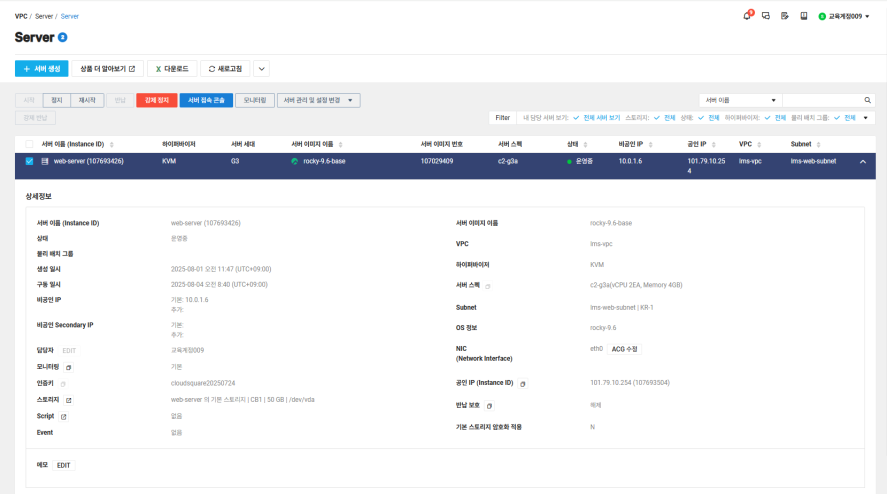

<sub>The `web-server` instance in the NCP console</sub>

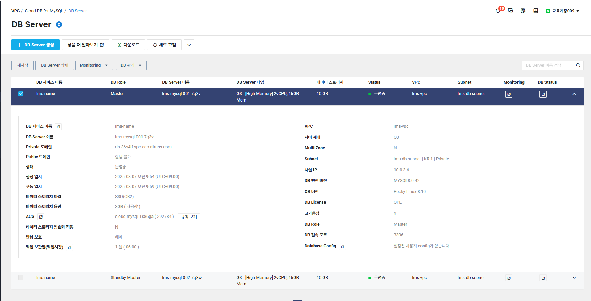

<sub>Cloud DB for MySQL running as Master / Standby Master</sub>

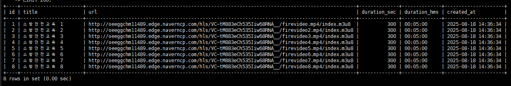

<sub>Transcoded videos registered in the database as Global Edge HLS streams</sub>

### 7.2 What the RFP asked for

<table>
  <tr>
    <td width="50%"><br><sub>Existing stack — MySQL / Apache / COURSEMOS LMS / NCP Storage · CDN (unlimited) / IBT / PKI / HA</sub></td>
    <td width="50%">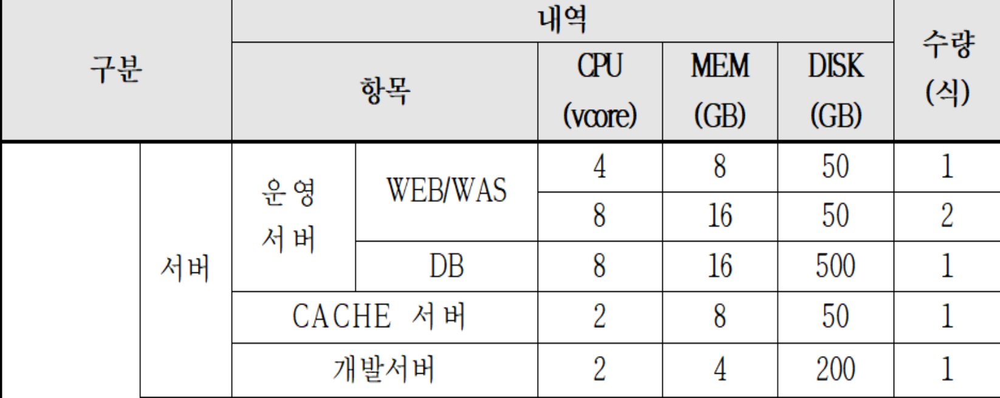<br><sub>Required servers — 3 production WEB/WAS, 1 DB, 1 CACHE, 1 DEV (6 total)</sub></td>
  </tr>
</table>

The full requirement list and the cost basis are in [`docs/rfp-summary.md`](docs/rfp-summary.md).

---

## 8. Learning-progress design

An LMS lives or dies on recording **who watched which video, and how far** in a way you can trust.
Rather than a single "played to the end" flag, each row stores both the **last playback position**
and the **furthest position reached**, which makes seek-ahead skipping detectable.

**Tables**

- `videos` — `id`, `title`, `url` (Global Edge HLS), `duration_sec`, `duration_hms`, `created_at`
- `video_progress` — `user_id`, `video_id`, `last_position_sec`, `max_position_sec`, `watched_seconds`, `duration_sec`, `completed`, `completed_at`, `first_started_at`, `last_updated_at`
- `users` — `id`, `username`, `full_name`, `email`, `phone`, `created_at`

**Overall progress per user**

```sql
SELECT user_id,
       COUNT(*)                                 AS videos_touched,
       SUM(completed)                           AS videos_completed,
       ROUND(AVG(GREATEST(last_position_sec, max_position_sec) /
             NULLIF(duration_sec, 0)) * 100, 1) AS overall_progress_pct
FROM   video_progress
WHERE  user_id = 1;
```

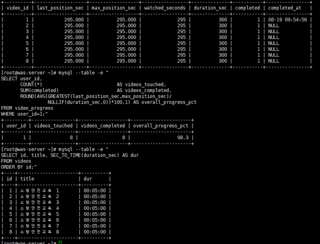

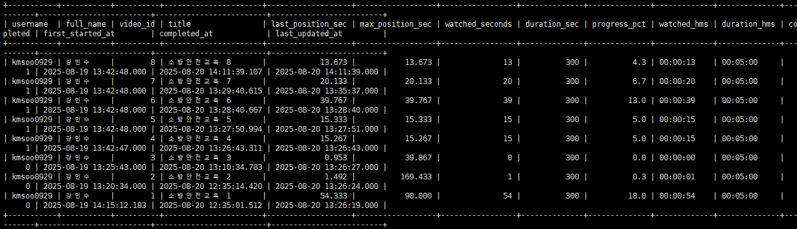

<sub>Position, watch time and completion accumulating per video, second by second</sub>

---

## 9. Work log

| Date | Work |
| --- | --- |
| 07.29 (Tue) | Proposal presentation — selection rationale, infrastructure analysis, first architecture, cost estimate |
| 08.01 (Fri) | Created the NCP VPC, subnets and ACG; provisioned `web-server` (Rocky Linux 9.6) with a public IP |
| 08.04 (Mon) | Set up SSH access (Xshell) and brought the web server up |
| 08.05 (Tue) | Connected VS Code Remote-SSH; built the page skeleton (login · main · classroom) |
| 08.06 (Wed) | Built the video study page — chapter list, player, watch-time counter |
| 08.07 (Thu) | Created Cloud DB for MySQL; wired live lecture broadcasting through OBS Studio |
| 08.08 (Fri) | Implemented the course list and certificate printing |
| 08.11 (Mon) | Benchmarked a production university LMS; built the learning portfolio screen |
| 08.12 (Tue) | Verified Cloud DB for MySQL high availability (Master / Standby Master) |
| 08.13 (Wed) | Connected the WAS server to the database over the private domain; set up accounts and grants |
| 08.14 (Thu) | Wired sign-up into the `users` table and verified the stored records |
| 08.18 (Mon) | Completed the Object Storage → VOD Station → Global Edge (HLS) pipeline; designed `video_progress` |
| 08.19 (Tue) | Put the Load Balancer in front of the service and verified progress recording through it |
| 08.20 (Wed) | Finished the per-user progress aggregation query and ran an end-to-end check |
| 08.21 (Thu) | Final presentation |

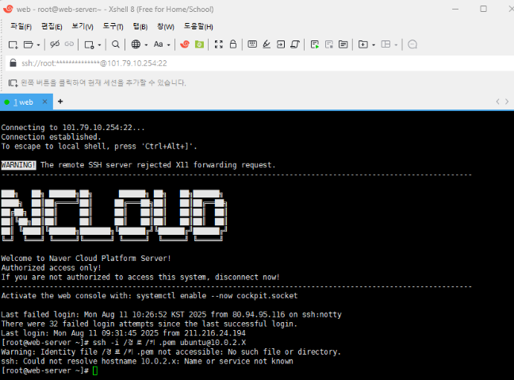

<sub>Connecting to the NCP `web-server` through Xshell</sub>

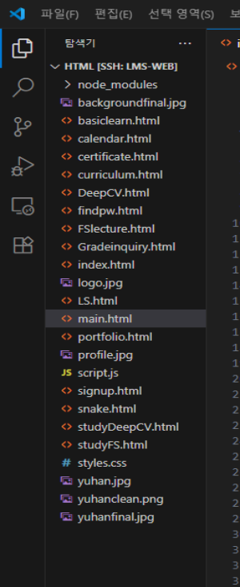

<sub>The LMS source on the server, opened over VS Code Remote-SSH</sub>

---

## 10. Scope, limits and takeaways

**What the project delivered**

- The **whole path** in one pass: read an RFP → turn it into an architecture → provision it on a real cloud
- A concrete lesson that implementing requirements and **deciding what to cut** within a fixed budget and schedule are two different skills
- Hands-on design with operations in mind: three-tier VPC isolation, database high availability, video delivery split away from the application tier

**What was cut (future work)**

- Elastic Web / WAS scaling with Auto Scaling
- The full security layer — WAF, Anti-DDoS
- Cloud DB for Cache for session and query performance
- A DEV subnet and IPsec VPN link to the academic-affairs system
- Cloud Functions to automate upload → transcoding

Building every element of the architecture would have cost far more time and money than the internship allowed,
so the strategy was to finish a **prototype made of the minimum set of components** first.

---

## 11. Documents

| Document | Contents |
| --- | --- |
| [`docs/architecture.md`](docs/architecture.md) | The five architecture revisions and the reasoning behind each |
| [`docs/rfp-summary.md`](docs/rfp-summary.md) | RFP summary, required infrastructure, cost basis |
| [`docs/journal.md`](docs/journal.md) | Detailed day-by-day work log |

---

### Notice

- This repository is a personal project record that **reconstructs a public procurement notice for learning purposes**. It is not an official deliverable of Yuhan University or Cloud Square Inc.
- The Yuhan University logo and visual design appear only as part of a UI reproduction exercise.
- Personal data in the screenshots (email addresses, people on camera) has been masked.

### Author

**Minsoo Kang** — Dept. of Artificial Intelligence, Konyang University · 2025 internship at Cloud Square Inc.
