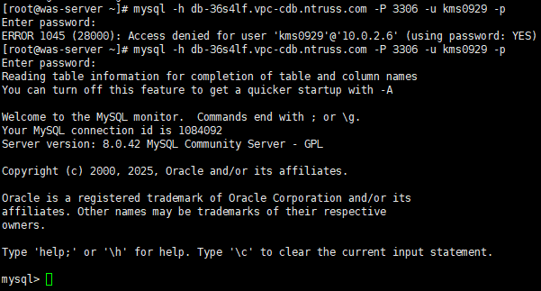
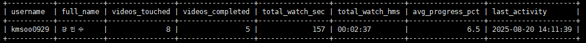

<b>English</b> · <a href="journal.ko.md">한국어</a>

# Work log

From the proposal on 2025.07.29 to the final presentation on 2025.08.21.

---

## 07.29 (Tue) — Proposal presentation

Notices on KONEPS were surveyed and analysed, and **Yuhan University Learning Management System (e-Class) maintenance**
was chosen against four criteria: fit with purpose, feasibility, budget reasonableness, and clarity of the published requirements.
The presentation covered an analysis of the existing infrastructure and requirements, the first architecture draft (v1), and a cost estimate.

---

## 08.01 (Fri) — Provisioning on NCP

- Created the VPC `lms-vpc` and the subnet `lms-web-subnet` (KR-1)
- Created the server `web-server` — KVM · G3 generation · `c2-g3a` (2 vCPU / 4 GB) · server image `rocky-9.6-base`
- Assigned private IP `10.0.1.6` and public IP `101.79.10.254`
- Configured ACG (network access control) rules

---

## 08.04 (Mon) — SSH access

Connected to `101.79.10.254:22` with Xshell and set up the operating environment.
Working through a pem-key path problem and a hostname resolution error was what made the
server's access-control model concrete.

---

## 08.05 (Tue) — Front-end work begins

Connected directly to the server with VS Code Remote-SSH and started building the LMS screens.
The skeleton came first: login (`index.html`), sign-up (`signup.html`), password recovery (`findpw.html`),
main (`main.html`) and classroom (`LS.html`).

---

## 08.06 (Wed) — Video study page

Built `studyFS.html` and `studyDeepCV.html`. The left column lists chapters with their state
(completed / in progress / downloaded), and a **watch-time counter** above the player accumulates
viewing time in real time.

---

## 08.07 (Thu) — Database and live lecture

- Created **Cloud DB for MySQL** — `lms-name` / `lms-mysql-001` · G3 High Memory (2 vCPU / 16 GB) · MySQL 8.0.42 · `lms-db-subnet` (private)
- Broadcast live through OBS Studio and received it in the LMS under the `[Live] DIP-week lecture` entry

The live entry appears in the chapter list marked `LIVE 방송 중` (on air) and plays in the same UI as recorded chapters.

---

## 08.08 (Fri) — Courses and certificates

Built the list of courses eligible for completion in `curriculum.html`, and made `certificate.html`
issue a certificate for any course whose completion criteria are met.
The certificate — department, student ID, name, course and issue date — opens in its own window.

---

## 08.11 (Mon) — Benchmarking and the learning portfolio

Studied the learning-portfolio screen of a university LMS in production, then built `portfolio.html`
around four areas: profile, self-introduction, activities and learning goals.

---

## 08.12 (Tue) — Database high availability

Confirmed in the console that Cloud DB for MySQL runs as `Master` (`lms-mysql-001`) and
`Standby Master` (`lms-mysql-002`), with HA set to `Y` and backups retained for one day (backup window 06:00).

---

## 08.13 (Wed) — WAS ↔ DB

Connected from `was-server` to MySQL over the private domain (`db-****.vpc-cdb.ntruss.com`, port 3306).
The first attempt failed with `ERROR 1045 (28000): Access denied` — the database account had not been
granted for the WAS server's private IP range.

---

## 08.14 (Thu) — Sign-up wired to the database

Verified that values entered on the sign-up screen land in the `users` table
(`id`, `username`, `full_name`, `email`, `phone`, `created_at`), with registrations accumulating in order.

---

## 08.18 (Mon) — The VOD pipeline

- Uploaded lecture source files to **Object Storage**
- Transcoded them with **VOD Station** into 1080p / 720p / 360p / Audio (MP4 · H.264 · AAC · Thumbnail)
- Published them as HLS (`index.m3u8`) on the **Global Edge** CDN domain
- Registered the published URLs in the `videos` table and designed `video_progress`

---

## 08.19 (Tue) — Load Balancer

Confirmed the service through the load balancer (`lms-lb-107699287-8e09815088dd.kr.lb.naverncp.com`).
From this point the LB domain, rather than the public IP, became the reference entry point.

---

## 08.20 (Wed) — Progress aggregation

Finished the queries that aggregate progress per user and per video.
Keeping both `last_position_sec` (last playback position) and `max_position_sec` (furthest position reached)
makes skipping detectable, and `progress_pct` and `completed` are derived from them.

---

## 08.21 (Thu) — Final presentation

The final presentation covered the selection rationale, the five architecture revisions, the day-by-day
implementation, the hard parts, and what came next. The stated next step was to
**save the project and keep a record of it on GitHub** — this repository is that record.
