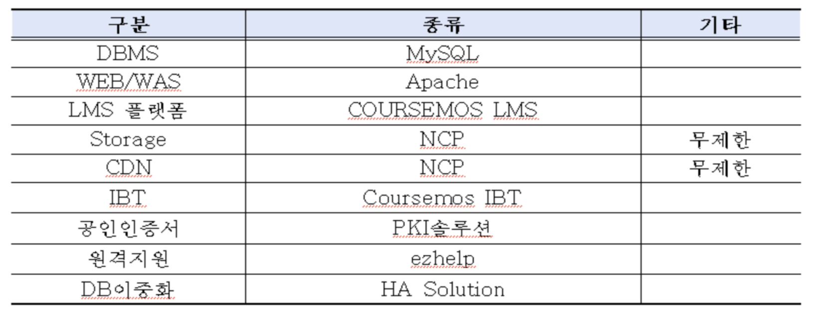
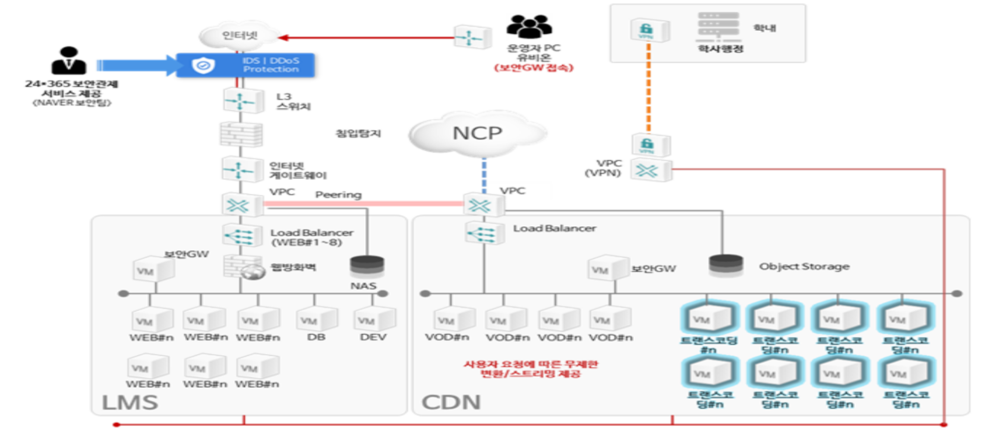
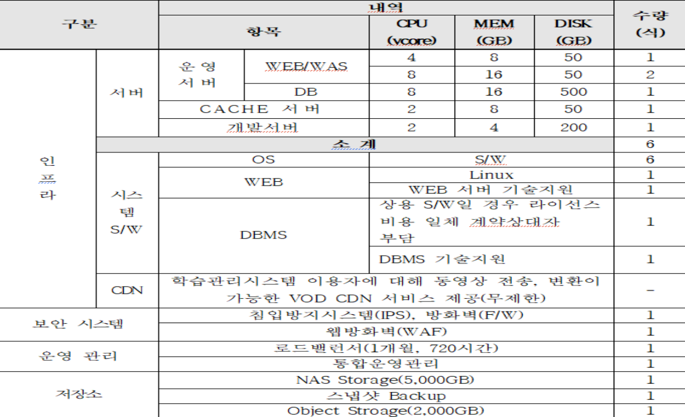

<a href="rfp-summary.md">English</a> · <b>한국어</b>

# 제안요청서 요약 및 비용 산정 기준

출처: 「유한대학교_2025 LMS - eClass 유지보수 및 클라우드 운영_제안요청서」 (나라장터 공고)

---

## 1. 사업 안내

| 항목 | 내용 |
| --- | --- |
| 사업명 | 유한대학교 학습 시스템(e-Class) 유지 보수 |
| 일정 | 2025년 3월 ~ 2026년 2월 (약 1년) |
| 사업자 선정 방식 | 일반 경쟁 입찰 (총액) |
| 유지보수금액 지급 | 매월 보고서 제출 · 승인 후 세금계산서 발행 |

## 2. 사업 배경 및 필요성

1. 온라인 교육의 중요성이 증대되는 시대의 흐름에 맞추어 교육의 질과 운영의 유연성을 지속적으로 확보
2. 교육성과의 분석 및 모니터링, 평가, 환류, 교육정책 연구 및 개발 환경 필요
3. 인재 양성을 위한 체계적인 교육혁신을 지원하고 학습자 분석을 지원하는 시스템 마련
4. 전문 업체를 활용한 안정적이고 체계적인 LMS 운용관리를 통한 사용자 만족도 제고

---

## 3. 기존 인프라 현황

| 구분 | 종류 | 기타 |
| --- | --- | --- |
| DBMS | MySQL | |
| WEB / WAS | Apache | |
| LMS 플랫폼 | COURSEMOS LMS | |
| Storage | NCP | 무제한 |
| CDN | NCP | 무제한 |
| IBT | Coursemos IBT | |
| 공인인증서 | PKI 솔루션 | |
| 원격지원 | ezhelp | |
| DB 이중화 | HA Solution | |

## 4. 기존 인프라 구성도

LMS 영역과 CDN 영역을 VPC Peering으로 연결하고, 운영자 PC는 보안 GW를 통해서만 접근하며
학내 학사행정은 VPN으로 연계되는 구조입니다. 24×365 보안관제가 전제되어 있습니다.

---

## 5. 클라우드 서비스 충족 사항

| 구분 | 항목 | CPU(vcore) | MEM(GB) | DISK(GB) | 수량 |
| --- | --- | --- | --- | --- | --- |
| 운영 서버 | WEB/WAS | 4 | 8 | 50 | 1 |
| 운영 서버 | WEB/WAS | 8 | 16 | 50 | 2 |
| 운영 서버 | DB | 8 | 16 | 500 | 1 |
| CACHE 서버 | — | 2 | 8 | 50 | 1 |
| 개발 서버 | — | 2 | 4 | 200 | 1 |
| **소계** | | | | | **6식** |

그 외 요구 항목

- **시스템 S/W** — OS(Linux) 6식, WEB 및 WEB 서버 기술지원, DBMS 및 DBMS 기술지원
  (상용 S/W일 경우 라이선스 비용 일체 계약상대자 부담)
- **CDN** — 학습관리시스템 이용자에 대해 동영상 전송·변환이 가능한 VOD CDN 서비스 제공 (무제한)
- **보안 시스템** — 침입방지시스템(IPS), 방화벽(F/W), 웹방화벽(WAF)
- **운영 관리** — 로드밸런서(1개월, 720시간), 통합운영관리
- **저장소** — NAS Storage 5,000GB, 스냅샷 Backup, Object Storage 2,000GB

---

## 6. 비용 산정 기준

제안 단계에서 NCP 요금제를 기준으로 예상 비용을 산정했으며, 다음 기준을 적용했습니다.

- 사업 일정: 2025년 3월 ~ 2026년 2월 (약 1년)
- 유지보수금액 지급: 매월 보고서 제출 · 승인 후 세금계산서 발행
- **VAT** — 모든 유료 서비스에 대해 10%의 부가가치세가 별도 부과 (NCP 기본 정책)
- 사용량 기반 과금 항목(트래픽, 변환량 등)은 이용량에 따라 달라지므로 **고정 지출만 산정**

산정 대상은 운영 서버(WEB/WAS, DB), CACHE 서버, 개발 서버, CDN+, NAS, Object Storage,
Load Balancer이며, 세부 단가는 제안 시점의 NCP 공개 요금표를 따랐습니다.
